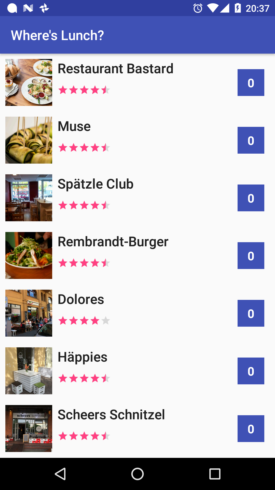

#Where is lunch?

This project is a simple sample app that display a list of restaurants nearby to the user and provides a voting functionallity to choose the most appropriate place for lunch in a daily basis.

  

The purpose of this project is to demontrate the use of some of the most recent technologies in the Android development world, this is reflected in a series of business rules being implemented on the application side when they would probably be more suitable for the backend.

#Technologies

This project uses:
- the kotlin programing language
- rxjava
- retrofit for network
- glide to load images
- dagger2 for dependency injection
- Junit + Mockito + Roboelectric for unit testing
- Espresso for functional testing

#Architecture

The project uses the MVVM architecture powered by the native Android databinding and the repository pattern.

#License

    Copyright 2016 Guilherme Holz

    Licensed under the Apache License, Version 2.0 (the "License");
    you may not use this file except in compliance with the License.
    You may obtain a copy of the License at

       http://www.apache.org/licenses/LICENSE-2.0

    Unless required by applicable law or agreed to in writing, software
    distributed under the License is distributed on an "AS IS" BASIS,
    WITHOUT WARRANTIES OR CONDITIONS OF ANY KIND, either express or implied.
    See the License for the specific language governing permissions and
    limitations under the License.

